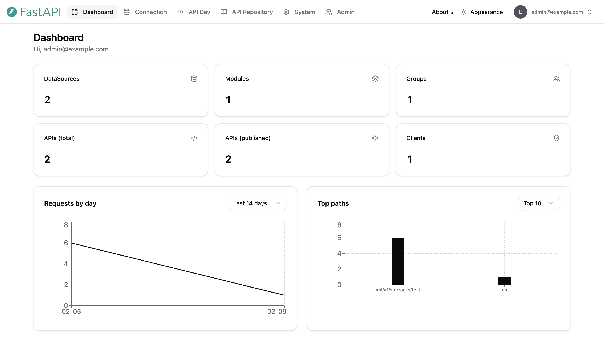

# pyDBAPI

**pyDBAPI** is a DB API platform: manage data sources (PostgreSQL, MySQL), define API endpoints with SQL (Jinja2) or Python scripts, and expose them through a dynamic gateway with auth, rate limiting, and versioning.

## Technology Stack and Features

- ⚡ [**FastAPI**](https://fastapi.tiangolo.com) for the Python backend API.
  - 🧰 [SQLModel](https://sqlmodel.tiangolo.com) for the app database (PostgreSQL).
  - 💾 **DataSources**: connect to external PostgreSQL and MySQL; connection pool and health checks.
  - 📝 **API Assignments**: define APIs with SQL (Jinja2 templates) or Python scripts (RestrictedPython sandbox).
  - 🚪 **Gateway**: dynamic `/{module}/{path}` routing, JWT auth (from POST /token/generate), rate limiting (Redis or in-memory).
  - 📌 Modules, groups, clients, version commits (api-assignments, macro-defs).
- 🚀 [**React**](https://react.dev) for the frontend (TypeScript, Vite, Tailwind, shadcn/ui).
  - 🤖 Auto-generated OpenAPI client.
  - 🦇 Dark mode support.
- 🐋 [**Docker Compose**](https://www.docker.com) for development and production.
- 📞 [**Traefik**](https://traefik.io) as reverse proxy with HTTPS (Let’s Encrypt).
- 🔒 Secure password hashing, JWT auth, email-based password recovery.
- ✅ Tests with [Pytest](https://pytest.org); CI/CD with GitHub Actions.

### Screenshots

[](img/login.png)  
[](img/dashboard.png)  
[](img/dashboard-items.png)  
[](img/dashboard-dark.png)  
[](img/docs.png)

## How To Use It

Clone the repository and run with Docker Compose:

```bash
git clone https://github.com/viethqb/pydbapi.git
cd pydbapi
cp .env.example .env   # if present; otherwise create .env from deployment docs
# Edit .env: SECRET_KEY, POSTGRES_PASSWORD, FIRST_SUPERUSER, FIRST_SUPERUSER_PASSWORD
docker compose up -d
```

### Configure

Set at least these in `.env` before deployment:

- `SECRET_KEY`
- `POSTGRES_PASSWORD`
- `FIRST_SUPERUSER` / `FIRST_SUPERUSER_PASSWORD`

You can (and should) pass these as environment variables from secrets.

See [deployment.md](./deployment.md) for details.

### Generate Secret Keys

```bash
python -c "import secrets; print(secrets.token_urlsafe(32))"
```

Use the output as password or secret key; run again for additional keys.

## Backend Development

See [backend/README.md](./backend/README.md).

## Frontend Development

See [frontend/README.md](./frontend/README.md).

## Deployment

See [deployment.md](./deployment.md).

## Development

See [development.md](./development.md) (Docker Compose, local domains, `.env`).

## Release Notes

See [release-notes.md](./release-notes.md).

## License

pyDBAPI is licensed under the MIT license.
