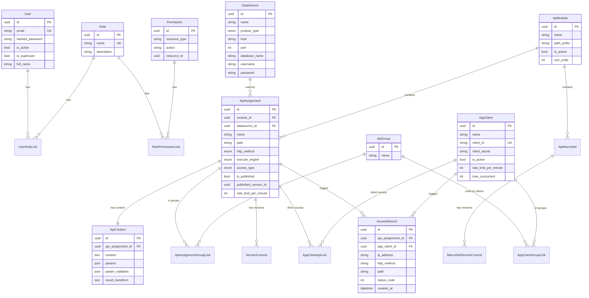

# Architecture

System architecture of pyDBAPI — how the components connect, the request lifecycle, and the data model.

---

## System Overview


### Component Roles

| Component | Role |
|-----------|------|
| **App** | Single container: Nginx serves static frontend and proxies `/api`, `/token` to FastAPI. FastAPI serves management API (`/api/v1/...`) and gateway (`/api/{path}`). Built from `docker/Dockerfile`. |
| **Prestart** | One-shot: waits for DB → Alembic migrations → seeds. Exits before app starts. |
| **PostgreSQL** | App database: users, roles, permissions, modules, APIs, clients, access logs, version commits. |
| **Redis** | Gateway config cache, rate-limit and concurrent-request counters. In-memory fallback if unavailable. |
| **StarRocks / Trino** | Optional services in docker-compose for use as external data sources. |

---

## Backend Architecture


### Directory Structure

```
backend/
├── app/
│   ├── main.py                  # FastAPI app, exception handlers, router includes
│   ├── api/
│   │   ├── deps.py              # Dependency injection (auth, session, permissions)
│   │   ├── pagination.py        # Shared pagination + permission filtering
│   │   └── routes/
│   │       ├── gateway.py       # /api/{path} — the dynamic API gateway
│   │       ├── token.py         # POST /token/generate (gateway JWT)
│   │       ├── login.py         # Dashboard auth (login, password reset)
│   │       ├── users.py         # User management
│   │       ├── datasources.py   # Data source CRUD + test
│   │       ├── modules.py       # Module CRUD
│   │       ├── api_assignments.py  # API CRUD, publish, versions, debug
│   │       ├── macro_defs.py    # Macro definition CRUD + versions
│   │       ├── groups.py        # API groups
│   │       ├── clients.py       # Client CRUD + group/API links
│   │       ├── roles.py         # Role CRUD + permission assignment
│   │       ├── permissions.py   # Permission listing
│   │       ├── overview.py      # Dashboard stats, charts
│   │       ├── access_logs.py   # Access log browsing
│   │       └── utils.py         # Health checks, test email
│   ├── core/
│   │   ├── config.py            # Settings (Pydantic, from .env)
│   │   ├── db.py                # SQLAlchemy engine + session
│   │   ├── security.py          # Password hashing, JWT encode/decode
│   │   ├── health.py            # Liveness + readiness probes
│   │   ├── pool.py              # External DB connection pool
│   │   ├── permission.py        # Permission check helpers
│   │   └── gateway/
│   │       ├── resolver.py      # path + method → ApiAssignment (module for permissions only)
│   │       ├── auth.py          # Gateway JWT verification + client access
│   │       ├── runner.py        # Execute API + write access log
│   │       ├── concurrent.py    # In-flight request limiter
│   │       ├── ratelimit.py     # Sliding-window rate limiter
│   │       ├── config_cache.py  # Redis config cache for API content
│   │       ├── request_response.py  # Param parsing, response formatting
│   │       └── firewall.py      # IP firewall (currently always-allow)
│   ├── engines/
│   │   ├── executor.py          # Dispatches to SQL or Script engine
│   │   ├── sql/
│   │   │   ├── template_engine.py  # Jinja2 rendering
│   │   │   ├── filters.py         # sql_string, sql_int, sql_in_list, ...
│   │   │   └── extensions.py      # ,  tags
│   │   └── script/
│   │       ├── executor.py      # RestrictedPython execution
│   │       ├── context.py       # db, http, cache, req, tx, ds, env, log
│   │       └── sandbox.py       # Sandbox setup + module whitelist
│   ├── models.py                # User, Message (SQLModel)
│   ├── models_dbapi.py          # All DBAPI models (DataSource, Module, API, ...)
│   ├── models_permission.py     # Permission, Role, UserRoleLink, ...
│   ├── schemas_dbapi.py         # Pydantic schemas for request/response
│   └── alembic/
│       ├── env.py               # Alembic configuration
│       └── versions/            # Migration scripts
├── scripts/
│   └── prestart.sh              # Migration + seed runner
└── Dockerfile
```

---

## Gateway Request Flow


### Status Codes

| Step | Failure | Code |
|------|---------|------|
| Firewall | IP blocked | 403 |
| Resolve | Path/method not found | 404 |
| Auth | Invalid/missing token | 401 |
| Auth | Client can't access API | 403 |
| Concurrent | Too many in-flight | 503 |
| Rate limit | Over requests/minute | 429 |
| Params | Missing required / type error | 400 |
| Execute | DB error / script error | 500 |
| Success | — | 200 |

---

## Data Model



---

## Deployment Architecture


### Deployment Flow

```
1. Code pushed to master (staging) or release published (production)
2. GitHub Actions triggers on self-hosted runner
3. docker compose build        — builds app image (from docker/Dockerfile)
4. docker compose up -d        — starts all services
5. prestart container:
   a. Waits for PostgreSQL health check
   b. Runs alembic upgrade head
   c. Verifies migration is at head (fails deployment if not)
   d. Seeds initial data (superuser, roles, permissions)
   e. Exits with code 0
6. Backend starts (depends on prestart success + db + redis healthy)
7. CI waits for backend health check (up to 120s)
8. CI verifies alembic is at head
9. Deployment complete
```

### Rollback Flow

```
1. Identify the issue (health check failed, errors in logs)
2. Run: ./scripts/rollback.sh [--migrate -1]
3. Script stops backend + frontend
4. (Optional) Rolls back last alembic migration
5. Restarts services
6. Waits for health check (up to 60s)
7. Verify: docker compose ps + alembic current
```

---

## Frontend Architecture

```mermaid
graph TB
    subgraph "React SPA"
        Router["TanStack Router<br/>File-based routing"]
        Query["TanStack Query<br/>Server state"]
        Auth["useAuth Hook<br/>JWT + localStorage"]
        Perms["usePermissions Hook<br/>RBAC checks"]

        subgraph "Pages"
            Dashboard["Dashboard"]
            Connection["Connection<br/>(Data Sources)"]
            APIDev["API Dev<br/>(Modules / APIs / Macros)"]
            System["System<br/>(Groups / Clients / Logs)"]
            Admin["Admin<br/>(Users / Roles)"]
        end

        subgraph "Services"
            APIReq["api-request.ts<br/>Shared fetch + auth + signal"]
            Services["Service modules<br/>(one per entity)"]
        end
    end

    Router --> Pages
    Pages --> Query
    Query --> Services
    Services --> APIReq
    APIReq -->|"fetch + Bearer token"| Backend["Backend API"]
    Auth --> APIReq
    Perms --> Pages
```

### Key Frontend Patterns

| Pattern | Implementation |
|---------|---------------|
| **Routing** | TanStack Router with file-based route generation (`routeTree.gen.ts`). |
| **Server state** | TanStack Query (`staleTime: 30s`, `gcTime: 5min`, `refetchOnWindowFocus: false`). |
| **Auth** | JWT stored in `localStorage`. `useAuth` hook manages login/logout. `OpenAPI.TOKEN` supplies the token to generated client + custom `request()`. |
| **Permissions** | `usePermissions` hook fetches user permissions, memoized with `useMemo`/`useCallback`. `<Can permission="resource:action">` component for conditional rendering. `<RoutePermissionGuard>` for route-level access control. |
| **API calls** | Centralized `request()` in `lib/api-request.ts` handles auth headers, error parsing, and `AbortSignal` for cancellation. |
| **Forms** | React Hook Form + Zod schemas. Shared validation in `lib/validations.ts`. |
| **UI** | shadcn/ui (Radix primitives) + Tailwind CSS 4. Dark mode via `ThemeProvider`. |
| **Error handling** | `<ErrorBoundary>` component wraps dashboard sections. Global exception handlers in `main.tsx`. |

---

## Security Model


| Layer | Mechanism | Scope |
|-------|-----------|-------|
| **Dashboard** | Email/password → JWT | Users, admin UI, management API |
| **Gateway** | client_id/secret → JWT | External API consumers |
| **RBAC** | Roles → Permissions (resource_type + action + optional resource_id) | Dashboard route and feature visibility |
| **API Access** | Client → Group → API (or direct link) | Which APIs a client can call |
| **Rate Limit** | Sliding window per client/API | Prevents abuse |
| **Concurrent Limit** | In-flight counter per client/IP | Prevents resource exhaustion |

---

## See Also

- **[OVERVIEW.md](./OVERVIEW.md)** — End-to-end flow and feature list.
- **[TECHNICAL.md](./TECHNICAL.md)** — Detailed gateway logic, parameters, engines.
- **[ENV_REFERENCE.md](./ENV_REFERENCE.md)** — Complete environment variable reference.
- **[TROUBLESHOOTING.md](./TROUBLESHOOTING.md)** — Common issues and solutions.
